# Scraping Process Flow

## Complete Pipeline Flow


## Stage Progression Flow


## Concurrent Website Scraping Flow

```mermaid
sequenceDiagram
    participant API as API Endpoint
    participant Orchestrator as ScrapingOrchestrator
    participant Semaphore as Semaphore (Limit: 5)
    participant Scraper as WebsiteScraperService
    participant DB as Database
    
    API->>Orchestrator: crawl_and_enrich_zone()
    Orchestrator->>Orchestrator: Discover Companies (Apify)
    Orchestrator->>DB: Store Companies
    
    Note over Orchestrator: Queue companies with websites
    
    loop For Each Company (Batch)
        Orchestrator->>Semaphore: acquire() - Wait if limit reached
        Semaphore-->>Orchestrator: Lock Acquired
        
        par Concurrent Scraping (Up to 5)
            Orchestrator->>Scraper: scrape_website(url)
            Scraper->>Scraper: Initialize Browser
            Scraper->>Scraper: Load Page
            Scraper->>Scraper: Extract Hours
            Scraper->>Scraper: Detect Impound
            Scraper->>Scraper: Extract Services
            Scraper-->>Orchestrator: Return Data
            
            Orchestrator->>DB: Update Company
            Orchestrator->>DB: Set Stage: WEBSITE_SCRAPED
            Orchestrator->>Semaphore: release()
        end
    end
    
    Orchestrator-->>API: Return Statistics
```



## Error Handling Flow


## Status Tracking Flow


## Complete System Architecture

```mermaid
graph TB
    subgraph "API Layer"
        API1[POST /crawl/zone/{id}]
        API2[GET /crawl/status/{id}]
        API3[POST /crawl/refresh-stale]
    end
    
    subgraph "Service Layer"
        CrawlService[CrawlService]
        Orchestrator[ScrapingOrchestrator]
        ApifyService[ApifyService]
        EnrichmentService[EnrichmentService]
        WebsiteScraper[WebsiteScraperService]
    end
    
    subgraph "Data Sources"
        GoogleMaps[Google Maps<br/>via Apify]
        Websites[Company Websites<br/>via Playwright]
        Facebook[Facebook Profiles<br/>Future]
        GoogleBusiness[Google Business<br/>Future]
    end
    
    subgraph "Database"
        Companies[(Companies Table)]
        Snapshots[(Enrichment Snapshots)]
        Users[(Users Table)]
    end
    
    API1 --> CrawlService
    API2 --> Orchestrator
    API3 --> Orchestrator
    
    CrawlService --> Orchestrator
    Orchestrator --> ApifyService
    Orchestrator --> EnrichmentService
    Orchestrator --> WebsiteScraper
    
    ApifyService --> GoogleMaps
    WebsiteScraper --> Websites
    EnrichmentService --> Facebook
    EnrichmentService --> GoogleBusiness
    
    Orchestrator --> Companies
    EnrichmentService --> Snapshots
    Companies --> Snapshots
    
    style API1 fill:#e1f5ff
    style API2 fill:#e1f5ff
    style API3 fill:#e1f5ff
    style Orchestrator fill:#fff3cd
    style Companies fill:#d4edda
```

## Batch Processing Flow


